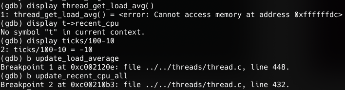
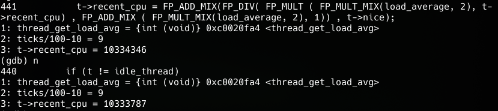
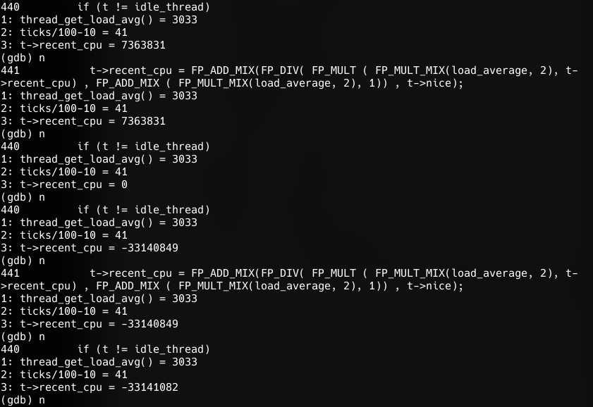
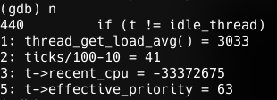
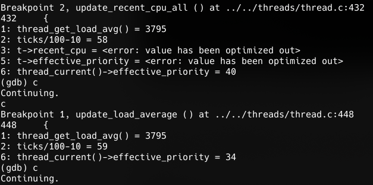

# 
 CS302 OS Project 1 - Threads Final Report

 Shijie Chen 11612028

## Project 1- Threads Implementation Change

### Task 1

Task 1 is implemented as is described in the design document.

### Task 2

No change regarding data structures. I added `thread_donate_priority()` and `thread_update_priority()` in `thread.c` and `thread.h` to improve the readability of my code.

As for algorithm, I abandoned `insert_ordered` for locks and semaphores. Rather, I use sort each time a thread is waked up. The reason is that priority of waiters may be changed and a deletion-reinsertion is needed for each change. I use `list_sort` to simplify this process and guarantee the priority_queue property.

### Task 3

No change on data structures. I added `update_recent_cpu()`, `update_mlfqs_priority()` and `compute_load_avg()` in `thread.c` and `thread.h` since these functions may be called more than once.

### Reflection on the Project

Thanks to the code design and test analysis done in the design part, the code implementation of this project was generally smooth. The logic didn't change much while implementation is altered to eliminate bugs. It took some time to learn to use the provided list facilities and fixed_point arithmetic library.

The implementation of Pintos is not optimized for best performance. E.g. A better data structure or sorting algorithm can be implemented. For efficient alarms, a seperate list can be used to maintain the blocked lists. I simply use `list_for_each()` to check status. The time complexity doesn't change but performance may be better in practice.

## Pintos-GDB
According to the formula, priority is determined by load_average as well as the recent_cpu of threads. This inturn will affect the ready list which further affect the value of load_average. 

### 1. Set Break Points and Monitors

To find the bug, I set 2 break points: `thread_update_load_average()` and `update_recent_cpu_all()`. 3 variables are monitored: `ticks/100-10` (the seconds corresponding to test), `thread_get_load_avg()` and `t->recent_cpu`(when inside `update_recnet_cpu_all()`).

In this way, I can track the change of the variables especially in `update_recent_cpu_all()`.

e.g. A normal computation of recent_cpu:

### 2. Fast Forward to 40th Seconds
Bug occurs at the 40th second. So I fast forward to 39th second by `c`.

### 3. Step into Methods and Locate Problem
By stepping into the problem, I found an artihmetic overflow bug in `update_recent_cpu_all()` in the 41th second.

Here t->recent_cpu become negative after the computation.  

The bug is that the implementation does multiplication first and then division. This will result in a very large intermediate value that overtime overflowed. This change will also affect the priority of threads causing the display stuck.

To validate my point, I displayed the priority of current thread and found that it's set to 63(PRI_MAX) after overflow.

Later, at the 59th second, priority is resumed to 34 and the log resumes running. Notice that the output value at the leap is exactly 3795/100 at "40 seconds". 

This shows the reason for the leap: its actually the load_average after 59 seconds rather than 40 seconds. Due to the wrong priority caused by computation overflow, the output of the 18 seconds in between is missed.