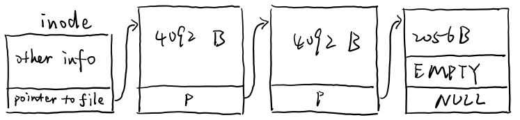

# 
 SUSTech CS302 OS Lab11 Report
**Name:** Shijie Chen 

**ID:** 11612028
## Questions
* **Consider a really simple filesystem, cs302fs, where each inode only has 10 direct pointers, each of which can point to a single file block. Direct pointers are 32 bits in size (4 bytes). What is the maximum file size for cs302fs?**
  
  The maximum file size for cs302fs is $10 \times 4KB = 40KB$

* **Consider a filesystem, called extcs302fs, with a construct called an extent. Extents have a pointer (base address) and a length (in blocks). Assume the length field is 8 bits (1 byte). Assuming that an inode has exactly one extent. What is the maximum file size for extcs302fs?**
  
  A file can have at most $2^8 - 1 = 255$ blocks. 
  
  Therefore the maximum file size is $255 \times 4KB = 1020KB$
  
* **Consider a filesystem that uses direct pointers, but also adds indirect pointers and double-indirect pointers. We call this filesystem, indcs302fs. Specifically, an inode within indcs302fs has 1 direct pointer, l indirect pointer, and 1 doubly-indirect pointer field. Pointers, as before, are 4 bytes (32 bits) in size. What is the maximum file size for indcs302fs?**   
  
  The direct file pointer can handle at most $1 \times 4KB = 4KB$

  The indirect pointer can handle at most $1 \times \frac{4KB}{4B} \times 4KB = 4MB$

  The doubly-indirect pointer can handle at most $1 \times \frac{4KB}{4B} \times \frac{4KB}{4B} \times 4KB = 4GB$

  Therefore, the maximum file size for indcs302fs is $4KB + 4MB + 4GB$.

* **Consider a compact file system, called compactfs, tries to save as much space as possible within the inode. Thus, to point to files, it stores only a single 32-bit pointer to the first block of the file. However, blocks within compactfs store 4,092 bytes of user data and a 32-bit next field (much like a linked list), and thus can point to a subsequent block (or to NULL, indicating there is no more data). First, draw a picture of an inode and a file that is 10 KBytes in size. Second, what is the maximum file size for compactfs (assuming no other restrictions on file sizes)?**
  
  * picture:
    
  * The file size in compactfs is unlimited, as is the length of a linked list.

* **The Linux journaling file system writes the content of all modified disk blocks to the log. Your friend Bob considers such logging to be wasteful since copying the content of modified disk blocks to the log doubles the amount of disk writes for each logged file system operation. Bob decides to implement a more efficient journaling file system. In particular, he decides to only record an operation’s name and parameter in the log file instead of recording the content of all modified blocks. For example, for an operation that creates file “/d/f”, the file system would append the transaction record of the form [create “/d/f”] to the log. Bob’s file system ensures that the corresponding transaction record is written to the log before the modified disk blocks are flushed to disk. Upon crash and recovery, Bob’s file system re-executes the logged file system operations and truncates the log.  Bob’s new logging mechanism is certainly more efficient since each transaction record is much smaller than that with Linux’s logging. Is his design also correct? Specifically, can it recover a file system correctly from crashes? Explain your reasoning and give concrete examples.**

    No. This logging mechanism is essentially logging changes. Therefore, the sequence of operations matter. To successfully recover a state, we must ensure the correctness of all operations before it in the log. This is almost impossible. A single logging mistake (or storage device failure) will lead to a crush in the recovery of this file system.

* **Your friend suggests doubling the Pintos block size from 512 bytes to 1,024 bytes, since that means you will be able to reach twice as much data from the direct pointers (as a result, medium sized files could fit entirely within the direct region). Why might it be a bad idea to increase the block size?** 
  
  Increasing block size will make internal fragmentation worse. Since a file will occupy at least a file, increasing block size will decrease the maximum number of files in a file system.

* **The NFS authors had a goal of transparency. They wanted applications to be unable to distinguish whether a file system was (a) a remote file system served from an NFS server; or (b) a typical, local Unix file system. They did not succeed (in fact, their goal was impossible). Briefly state one way in which application code can experience different behavior when interacting with a remote NFS file system versus a local Unix file system. Your answer should be in terms of what application code sees, rather than in terms of what a global observer sees.**
* There may be operation failures (or hang) due to network connection issues. E.g. sudden connection failure to the remote NFS server. While a local unix file system can always maintain a stable link to the storage hardware (unless you unplug the data wires manually).

