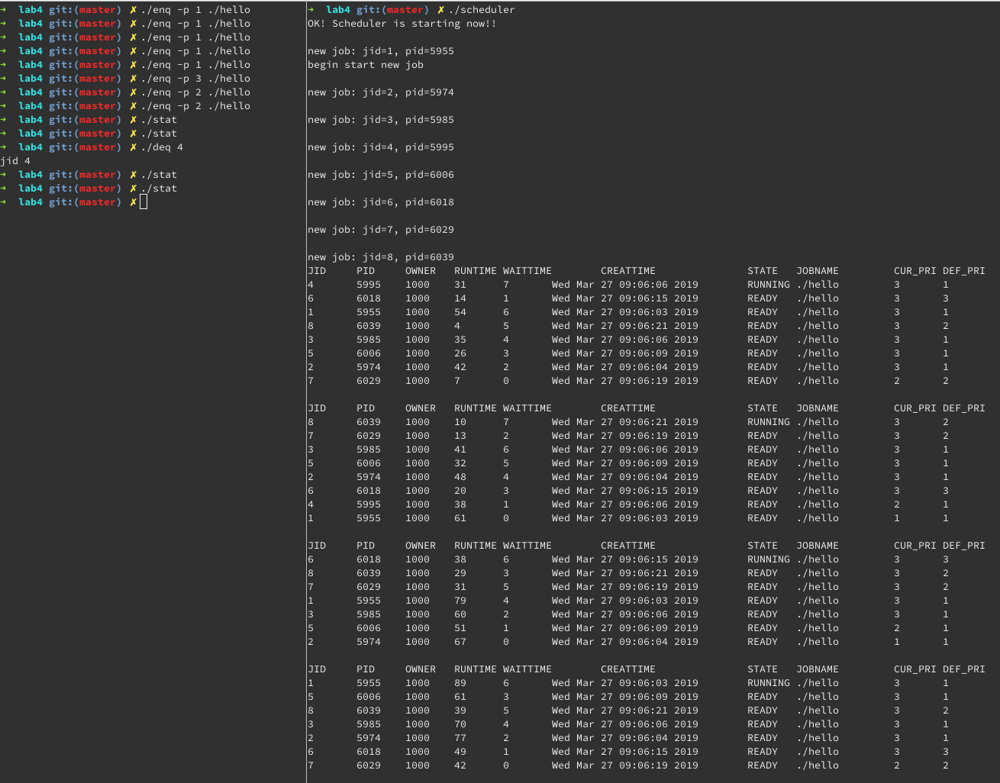

# SUSTech CS302 OS Lab4 Report

Student Name: Shijie Chen	ID: 11612028

Time: 2019.3.26

## Experiments

### Fundamental

1. **What is a process? What is a program? And what is the difference?**
2. **What is job? And what is the difference between process and job?**
3. **What are the differences between job scheduling and process scheduling?**
4. **What are the similarities and differences among structures, classes, and unions in C++ language：**

### Knowledge

* **How many states are in a job? And what are they?**

  3: RUNNING, READY, DONE

* **What programs are used in this experiment for job control? And their function?**

  `scheduler` is used for job control. Functions include `do_enq()`, `do_deq()`, `updateall()`, `jobselect()`, `jobswitch()` and `schedule()`

* **What is used for inter-process communication in this experiment? And its function?**

  FIFO. It's used to transmit commands between `scheduler`, `enq` and `deq`.

### Questions

* **What should be noted when printing out the job name?**

  The job name is indeed `argv[0]`.

* **Submit a job that takes more than 100 milliseconds to run**

  Simply an infinite loop will serve this purpose well.

      ```C
      int main() {
          while(1);
          return 0;
      }
      ```

  Compile and run `./enq [-p pri] ./hello`

* **List the bugs you found and your fix (code and screenshot)**

  1. '；' -> ';' (Scheduler.c @ 84)
      ```C
         p->job->wait_time += 1;
      ```

  2. time slicing, $100ms = 100000us$

     ```C
     interval.tv_usec = 100000
     ```

     

  3. cannot add more than 3 jobs

     This is due to that `next` job is not deleted from ready list and `next->next` is not set to NULL before its reinserted to the ready list during `jobswitch()`, which results in a loop in the ready list and `updateall()` falls into an infinite loop.

     ```C
     void jobswitch() {
         if (head) {
             for (p = head; p->next != NULL; p = p->next);
             p->next = current;
             current->next = NULL; // fix
         } else {
             head = current;
         }
     }
     
     ```

     

  4. job deque may lead to the loss of the whole ready list

     This is due to when `select` is `head` and is set to NULL. Instead, `head` should be set to `select->next`. Similar problem exists in `jobselect()`.

     ```C
     void do_deq(struct jobcmd deqcmd) {
         //...
         if (head) {
             for (prev = head, p = head; p != NULL; prev = p, p = p->next) {
                 if (p->job->jid == deqid) {
                     select = p;
                     selectprev = prev;
                     break;
                 }
             }
     
             selectprev->next = select->next;
             if (select == selectprev)	head = select->next; //fix
         }
         //...
     }
     
     struct waitqueue* jobselect() {
         //...
         if (head) {
     		for (prev = head, p = head; p != NULL; prev = p, p = p->next) {
     
     			if (p->job->curpri > highest) {
     				select = p;
     				selectprev = prev;
     				highest = p->job->curpri;
     				longest = p->job->wait_time;
     			} else if (p->job->curpri == highest && p->job->wait_time > longest) {
     				select = p;
     				selectprev = prev;
     				highest = p->job->curpri;
     				longest = p->job->wait_time;
     			}
     		}
     
     		selectprev->next = select->next;
     
     		if (select == selectprev) head = select->next; //fix
     	}
         //...
     }
     
     ```

     

* **Run the job scheduler program and analyze the execution of the submitted job**

  After fixing the above bugs and add functionalities according to the tutorial, the scheduler is now fully functional:

  

* **Understand the process of job scheduling: (Execution results and corresponding code)**

  * Submit a new job

    When submitting a new job, a new node of type `waitqueue` is constructed and added to ready list. Meanwhile a new process for this job is forked and blocked. The scheduler takes over at the next timer interrupt.

    ```C
    // newjob is already initilized
    newnode = (struct waitqueue*)malloc(sizeof(struct waitqueue));
    newnode->next = NULL;
    newnode->job = newjob;
    int c = 0;
    if (head) {
        for (p = head; p->next != NULL; p = p->next, c++) {
        }
        p->next = newnode;
    } else {
        head = newnode;
    }
    
    /* create process for the job */
    if ((pid = fork()) < 0)
        error_sys("enq fork failed");
    
    /* In child process */
    if (pid == 0) {
        newjob->pid = getpid();
        /* block the child wait for run */
        raise(SIGSTOP);
        /* dup the globalfile descriptor to stdout */
        dup2(globalfd,1);
        if (execv(arglist[0],arglist) < 0)
            printf("exec failed\n");
        exit(1);
    } else {
        newjob->pid = pid;
        printf("\nnew job: jid=%d, pid=%d\n", newjob->jid, newjob->pid);
    }
    ```

    

  * End of job execution

    When a job is finished, it's destroyed and it's memory is freed.

    ```C
    if (current && current->job->state == DONE) {   /* current job finished */
    		/* job has been done, remove it */
    		for (i = 0; (current->job->cmdarg)[i] != NULL; i++) {
    			free((current->job->cmdarg)[i]);
    			(current->job->cmdarg)[i] = NULL;
    		}
    		free(current->job->cmdarg);
    		free(current->job);
    		free(current);
    		current = NULL;
    	}
    ```

    

  * Job scheduling due to priority

    The job with highest priority is selected as `next` and will be running in the next `jobswitch()` call.

    The code is same as the next question.

  * Job scheduling due to time slice

    When two job has the same priority (the highest priority) the job with longer waiting time is selected as `next`, as is described in the following code snippet.

    ```C
    if (head) {
    		for (prev = head, p = head; p != NULL; prev = p, p = p->next) {
    
    			if (p->job->curpri > highest) { //scheduling due to priority
    				select = p;
    				selectprev = prev;
    				highest = p->job->curpri;
    				longest = p->job->wait_time; //scheduling due to time slice
    			} else if (p->job->curpri == highest && p->job->wait_time > longest) {
    				select = p;
    				selectprev = prev;
    				highest = p->job->curpri;
    				longest = p->job->wait_time;
    			}
    		}
    
    ```

    

## Conclusion

