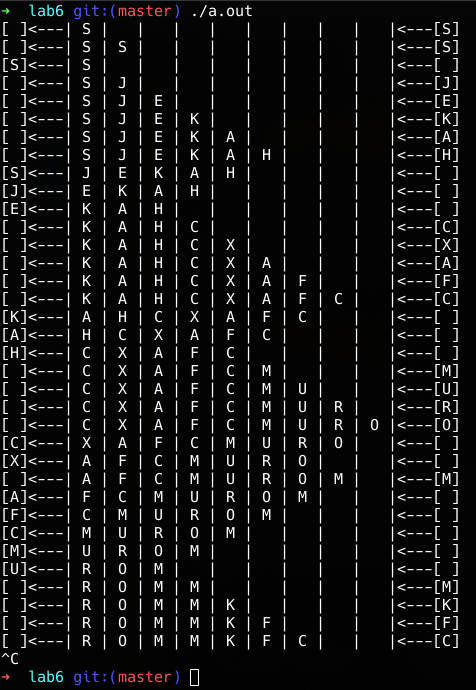

# 
 SUSTech CS302 OS Lab6 Report
Student Name: Shijie Chen 
ID: 11612028
Experimental Environment: Linux

## Experiments
### Fundamental

#### Function of APIs:
(The following answers are based on the man page for each function.)
* pthread_create: Starts a new thread in the calling process executing `start_routine ()`.
* pthread_join: Waits for the thread specified by `thread` to terminate. Return Immediately if it's already terminated.
* pthread_mutex_lock: Lock the lock specified by `mutex` and block if it's owned by another thread.
* pthread_cond_wait: Block on a condition variable.
* pthread_cond_signal: Unblock threads blocked on a condition variable.
* pthread_mutex_unlock: Release the mutex object referenced by `mutex`. 

#### Producer-Consumer Problem

* Are the data that consumers read from the buffer are produced by the same producer?

    Products can be produced by different producers. For the given lab code, there's only one producer.

* What is the order of the consumers' read operations and the producer's write operations, and their relationship?

    For a product, its write must be before its read. Otherwise there's no limit on the order of read and write as long as the buffer is not full when write and not empty when read.

* Briefly describe the result of the program.

    The program simulates the Producer-Consumer Problem with one producer and one consumer using a product queue of size 9.

    

* What queue is used in this program, and its characteristics?

    A ring buffer (ring queue) is used in this program. It has a head (H) and tail (T) which controls the insertion and deletion of the queue. The ring queue supports efficient insertion and deletion (O(1)) at the head and tail of the queue.

* Briefly describe the mutal exclusion mechanism of this program.

    The key is that only one writer/reader can write/read the queue at a time. The producer/writer must acquire the mutex lock before write/read and release the mutex lock afterwards.

#### Readers-Writers Problem

* What interfaces of semaphore are used in this program?

    `sem_wait()` and `sem_post()`

* What are these interfaces used for?

    `sem_wait()` is used for acquring (waiting) for a semaphore. `sem_post()` is for releasing a semaphore.

* Can readers read at the same time? Why?

    Yes, since concurrent read will not cause inconsistency in data.

* Can writers write at the same time? Why?

    No, concurrent write may trigger race condition and cause inconsistency in data.

* What is the performance of the reader's synchronous reading?

    Performance is good overall. However, a reader must gain the lock to modify the readcount and release it in each read. This operation on the lock may hazard performance.

* After one writer writes, can the next writer write before one reader read? Why?

    Yes, as long as the next writer acquires the lock of the buffer before the next reader.
