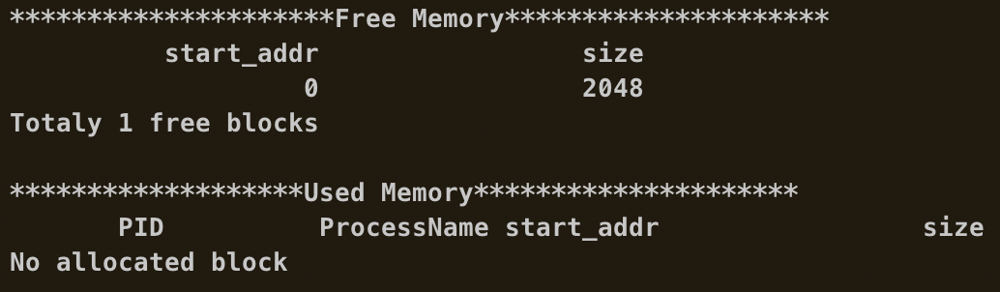
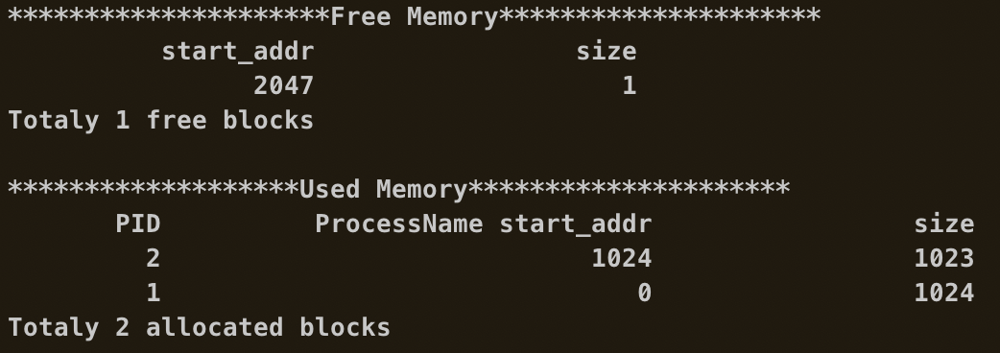
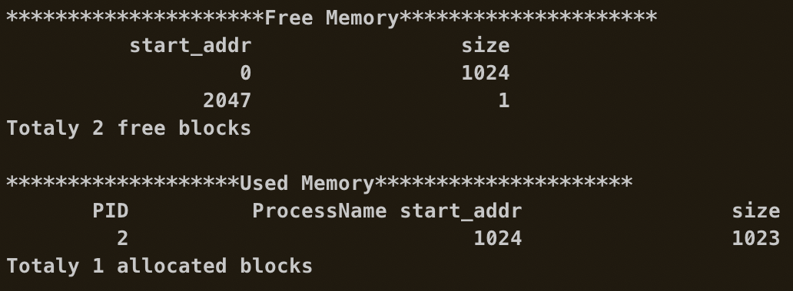
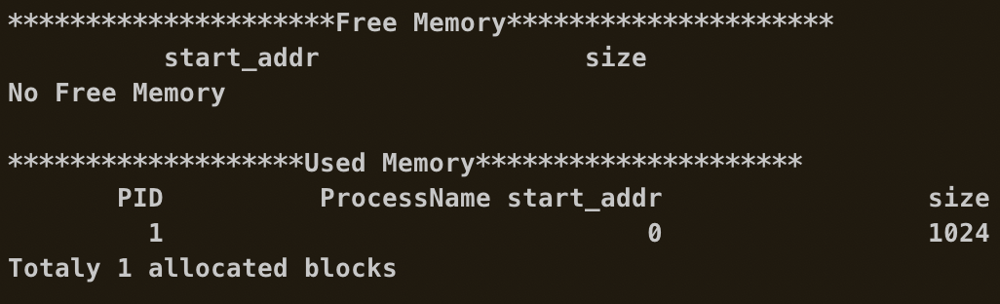
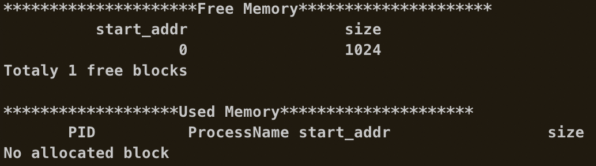
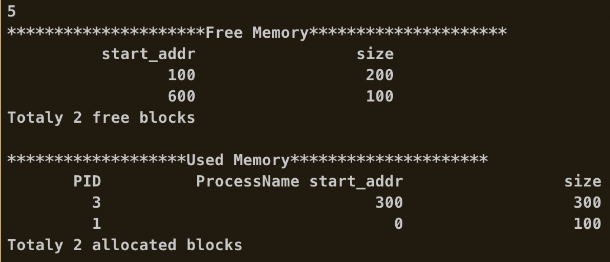
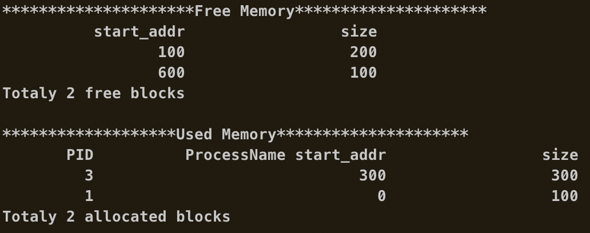
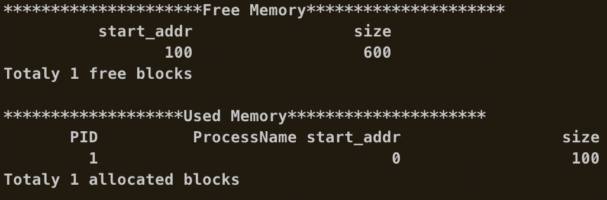

# CS302 OS Lab 8 Report

Name: Shijie Chen

Student ID: 11612028

Time: 24/04/2019

Experimental Envrionment: macOS, cpp

## Experiments:
### Fundamental:
   * What is Uniprogramming
     
        Only one program can sit in the main memory.
   * What is the shortcoming of Uniprogramming
     
        It's not efficient and powerful.
   * What is Multiprogramming

        Multiple programs share the main memory.
   * What is the shortcoming of Multiprogramming

        It's complex to implement and may cause memory waste due to fragmentation.
   * What is the segmentation mechanism and its advantage & disadvantages

        Main memory is divided into segments, each with its own base and limit. Segments can reside anywhere in the memory.

        Pros:

          1. Make data more logical.
          2. Provides good "protection".
          3. Reduce fragmentation.
        
        
        Cons:
        
          1. It's complicated since size of segmentations are not fixed.
          2. May generate small fragments.
   * What is the paging machanism and its advantages & disadvantages
     
        Allocate physical memory in fixed size chunks (“pages”).Every chunk of physical memory is equivalent.

        Pros:

          1. Simple to implement.
          2. Reduce external fragmentation.

        Cons:
        
          1. Page table requires extra memory space.
          2. Suffer from internal fragmentation.

### Memory managment (based on the code)
   * What kind of data structure is the memory block used for storage?
     
      1. struct free_block
      2. struct allocated_block
      3. linked lists of the above structs
   
   * How to reduce the occurrence of internal fragmentation when allocating memory? Briefly explain why this method works.
     
        Minimize the size of memory *slice*, which is the minimal unit of memory allocation.

        When we allocate memory, multiples of *slice* are allocated to a process. Suppose the size of *slice* is $N$ bytes. The size of internal fragment is at most $N-1$ bytes. Suppose the size of memory a process is asking for is M bytes. Only those process with $M \% N > 0$ will produce internal fragments. By reducing $N$, the possibility $p$ of fragment occurrence is reduced. E.g. $p = 0$ when $N = 1$ and $p=0.5$ when $N=2$.

   * What kind of strategy does the original program take to allocate memory? Briefly describe the benefits of doing so.
     
        Strategy: First Fit.

        The benefit is that it's easy to implement.

### Code result, screenshot and your comments:

#### test case 1:

Every operation is carried out successfully.

(1,2048),5

(3, 1024), 3(1023), 5

(4, 1), 5

(4, 2), 233

#### test case 2:

Insufficient memory while trying to create the second process (size 1).

(3, 1024), 5

 (3, 1)

 (4, 1), 5

  (4, 2)

233

#### test case 3:

An insufficient memory incident occurs. Also, there is a "hole" on the available free memory layout during the course the all operations.

(1, 700), (3, 100), (3, 200), (3, 300), (4, 2), 5

 (3, 300)

5

 (4, 3), 5

## Problems & Solutions

The implementation went well overall.

Problem: Ponter being freed is not allocated.

Solution: Use debug tools to identify the occurence of pointer free. Then remove the redundant one.

## Conclusion

This lab helps me to understand to mechanism of OS memory management. It's also a good programming exercise in C and with pointers.