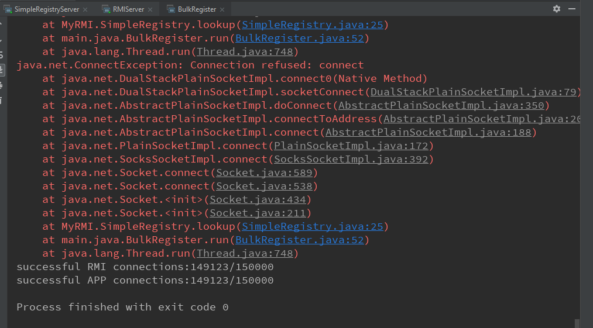

## System Design

### The Bulk Register Simulator

The Bulk Register Simulator is implemented in src/main/java/BulkRegister.java.

* Design

  The design of Bulk Register Simulator is simple: create a thread pool that holds a certain number of threads. Each thread will sent register request like a client. Then, use a latch to activate the threads *at the same time* to simulate high concurrency.

* Performance Metric

  The concurrency performance of RMI system is measured by two metrics: *successful RMI lookups* and *successful method invocation*. These metrics are given by successful RMI lookups/ method invocations divided by the  total number of threads (i.e. requests). Here, I use `java.util.concurrent.AtomicInteger` to guarantee correctness of the count. The result is computed after all threads are finished. 

  In most of the times, this two metrics have the same value. Difference can be observed when a client obtained the remote object but the invocation is unsuccessful.

  ```Java
  public class BulkRegister implements Runnable{
      private static AtomicInteger RMIcounter = new AtomicInteger();
      private static AtomicInteger appCounter = new AtomicInteger();
      static CountDownLatch latch; // use to activate the threads at the same time
      static CountDownLatch done; // use to wait for all threads to finish
      public static void main(String[] args) {
          int N = 100000; // number of total threads
          ExecutorService service = Executors.newCachedThreadPool(); // thread poll
          latch  = new CountDownLatch(1);
          done = new CountDownLatch(N);
          RMIcounter.set(0);
          appCounter.set(0);
          
          for(int i = 0; i < N; i++) {
              service.execute(new BulkRegister());
          }
          latch.countDown(); // signal the start for every thread
          try {
              done.await(); // wait for all threads to finish
              service.shutdown(); // close thread poll
              System.out.println("successful RMI connections:"+ RMIcounter.get() +"/" + N);
              System.out.println("successful APP connections:"+ appCounter.get() +"/" + N);
          } catch (InterruptedException e) {
              e.printStackTrace();
          }
      }
  
      @Override
      public void run() {
          // use uuid as an unique random string
          String username = String.valueOf(UUID.randomUUID());
          String password = String.valueOf(UUID.randomUUID());
          try {
              latch.await(); // wait for signal to start the request
              // ... some client side code for registration request
          } catch (Exception e) {
              System.out.println("BR error:" + e.toString());
              e.printStackTrace();
          } finally{
              done.countDown(); // decrease done on exit
          }
  
      }
  }
  ```

  One drawback of this design is that it takes a lot of memory. My computer (with 16GB RAM) can’t support simulation of 100000 requests.

  Still, this simulation cannot reflect the real situation when the number of threads are too large. But it gives a better approximation than creating and start threads in a for loop.

### Multi-threaded RMI Implementation

The multi-threaded RMI implementation aims at improving the ability of handling concurrent requests. More specifically, the `SimpleRegistryServer` must be able to handle concurrent TCP connection request from both `LocateSimpleRegistry.getRegistry()` and `SimpleRegistry.lookup()` and the `ServiceSkeleton` must be able to handle concurrent data packets with method invocation information.

The problems of previous RMI implementation is that the socket on server side will process requests before went on to listen(i.e. `ServerSocket.accept()`) for the next request. Connection failures occur when the server side socket is not listening.  Same thing happens in `ServiceSkeleton` which keeps listening incoming method invocation packets. Hence, we can improve concurrency by shrink the time gap between two `accept()`s.

* Design

  The idea is to separate request listening and request processing. The server side socket will listen for request as before, but will create a new thread for each request and go on to listen for the next one. In this way, the time gap between to `accept()`s is cut to the cost of creating new threads. This  cost can be further optimized by using `ThreadPoll`.  

  The core code for `SimpleRegistryServer` is as follows:

  ```Java
  public class SimpleRegistryServer {
      public static void main(String args[]) throws IOException {
          int port = 2099; // port listened by the server side
          ThreadPoolExecutor executor = new ThreadPoolExecutor(6,12, 200, TimeUnit.MICROSECONDS, new LinkedBlockingQueue<>()); // create a ThreadPoll
          ServerSocket serverSoc = new ServerSocket(port, 10000);
          // loop: accept request and create new thread to handle each connection
          while (true) {
              // create new connections.
              Socket newsoc = serverSoc.accept();
              executor.execute(new SimpleRegistryServerThread(newsoc)); // add the new request to task queue of ThreadPoll
          }
      }
      static class SimpleRegistryServerThread implements Runnable {
              Socket soc;
              SimpleRegistryServerThread(Socket s) {
                  this.soc = s;
              }
              @Override
              public void run() {
                  // ... code to process requests
                  // this part is about the same as what's previously in run() of SimpleRegistryServer
              }
      }
  }
  ```

  Similar multi-threaded design is applied to `ServiceSkeleton` to improve concurrency of remote app. 

## Major Design Decisions & Problems

* The use of `ThreadPoll`

  `ThreadPoll` is used to cut the cost of creating, destroying and switching between threads. `ThreadPoll ` will execute tasks in the task queue using a certain number of threads until the queue is empty instead of creating and destroying (thousands of) threads for each. 

* System parameter tuning

  During experiments, I found that some system parameters will limit the concurrency of RMI implementation. When I run the Bulk Register Simulator multiple times, success rate dropped substantially. I later checked the port usage by `netstatus -ano` in the command prompt and found that a large number of ports are used for TCP connections to the server port and are in TIME_WAIT status. That means these connections should have been terminated and the ports should be freed for later use.

  To solve this problem, I modified `MaxUserPort` that limits the maximum number of ports a server application can use and `TcpTimeWaitDelay` that controls the delay of terminating a closed TCP connection in Windows.  `MaxUserPort` is set to 1000-65000 and `TcpTimeWaitingDelay` is set to 30s(default 240s). After that, I got consistent performance in multiple runs of the simulator with the `SimpleRegisteryServer` and `RMIServer` keep running.

* Set `backlog` for server side sockets

  When the connection requests come in too fast that the number of waiting request exceeds the size of unprocessed request buffer of `ServerSocket`, the extra requests will be abandoned by `ServerSocket`, resulting in connection failure in client apps. 

  By add a `backlog` parameter, which specifies the buffer size of a socket, we can decrease the number of abandoned TCP connection requests and thus improve concurrency of the system.

## Running Result

Here, I compare the performance of java.rmi, MyRMI, and Multi-threaded MyRMI.

* Running result of Bulk Register Simulator

  The following screenshot shows the output of the simulator. Basically, the simulator will print stack trace of exceptions (for some exceptions, exception.toString() is printed) and the final result of performance metrics.

  

* Some notes on experiment design

  * The bulk register simulates concurrent connections by creating threads to send requests. In practice, the concurrency is bounded by CPU performance and the cost of thread switch. This concurrency is not the actual concurrency in real life.

    Therefore, the concurrency of “1000000” may be lower than “100000” since the switch cost is much higher.

  * **The experiments doesn’t access DBMS.** I let the `ServerActionImpl` , which acts as the server app, return `true` directly when `register()` is invoked without trying to insert a user to the remote database. 

    There are three reasons for that:

    * The experiment is to test the concurrency performance of RMI implementations. DBMS is obviously not part of RMI and should be taken care of by the server application developer.
    * Communications still happens between the CM of client and server. In this way, I can eliminate the bottleneck of database concurrency.

    * Actually, a single database server is not designed for high concurrency. Cache and distributed databases are used in real life to improve throughput. 

In this way, I run the simulator with code for Lab1 (java.rmi) and Lab2 (MyRMI). Results (successful invocation/ successful lookups) are shown in the following table (simulating 100000 concurrency causes memory shortage):

|     Concurrency      | 10    |   100   |   1000    |   10000   |    80000    |
| :------------------: | ----- | :-----: | :-------: | :-------: | :---------: |
| Multi-threaded MyRMI | 10/10 | 100/100 | 1000/1000 | 9977/9977 | 78716/78716 |
|        MyRMI         | 10/10 | 100/100 |  822/822  | 5199/5199 | 22619/22619 |

We can see from the above table that the Multi-threaded MyRMI has significant concurrency performance gain compared to the original MyRMI. 

