## System Design

### Module Design
#### Client Activities
The following diagram demonstrates the client app workflow.

When subscribing or publishing content to a non-existing topic, the system will create the topic automatically. The subscription is **durable** subscription. The id of a user is automatically generated by the database of user information and is graranteed to be globally unique.

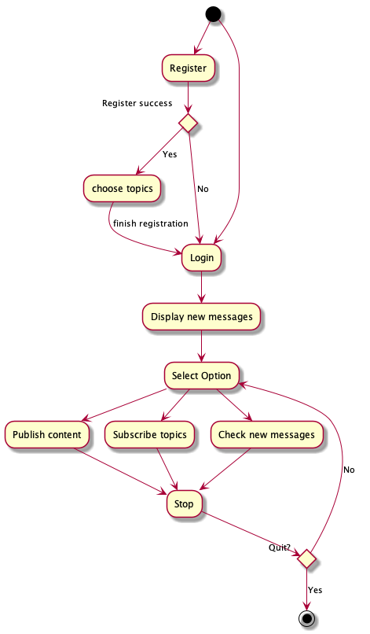

#### Display new messages

When we want to display all new messages for a user, the client will get the list of all subscribed topics from the app server through Java RMI. Then query and pull messages from the ActiveMQ server with the topics.

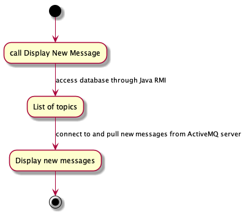

### Class Design

The main difference between this lab's design and the former labs is the added `SubscriptionUser` class. This class packs the interaction between ActiveMQ Server and the client app.

Note that a user can be a subscriber and a publisher at the same time. Therefore I pack the methods for subscription and publication into a single class. A single connection to ActiveMQ server is created for each `SubscriptionUser` object but different sessions are used for different tasks.

The `ServerAction` interface, the `UserDao` class and `ServerImpl` class are also modified to include methods that get `userId` and `topics` (all the topics that a user subscribed) from the remote database. This part is done through java RMI.
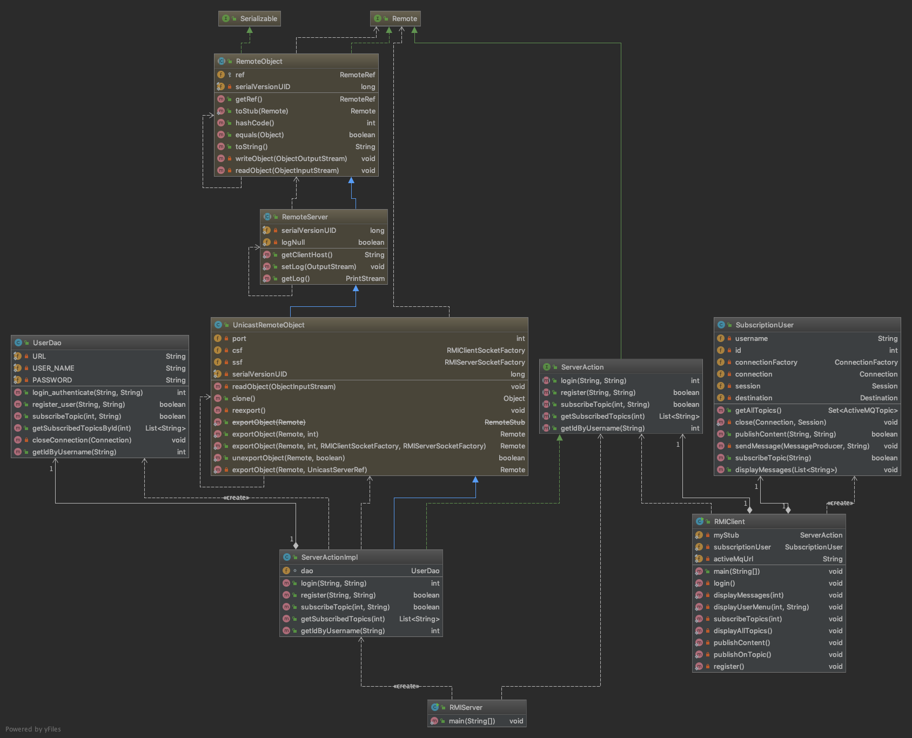

## Major Design Decisions & Problems
The major problem in this lab is the **implementation of one user subscribing multiple topics**.
The user needs to provide a unique `user name` to ActiveMQ server. Otherwise previous subscription will be overriden. 

To solve this problem, I set the `user name` to be `user_id_topic` where `id` is the id of the user and topic is the name of the subscribed topic.

## Running Result

To run the code, please run `SimpleRegistryServer` followed by `RMIServer`. Then start the ActiveMQ service on your machine. Then `RMIClient` is ready to go.

#### Main UI
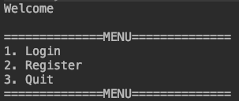
#### Publishing and Subscribing

#### Existing Topics and Subscribers
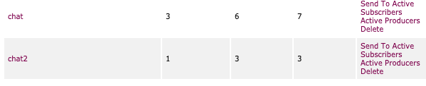
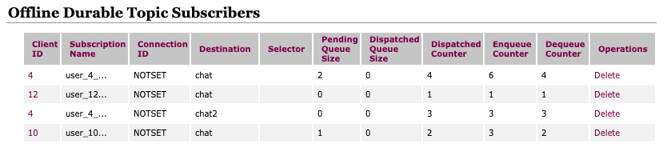

Here, the user `user` (with id user_4_...) has subsribed to both topic `chat` and `chat2`. 

#### User Story

We login as user `noob1` and publish some content to these topics:

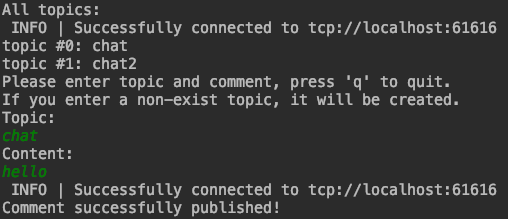

When publish content to a non-existing topic, that topic is created automatically. (This is accually an operation by mistake, as you may have noticed, but demonstrates this feature just fine :). )

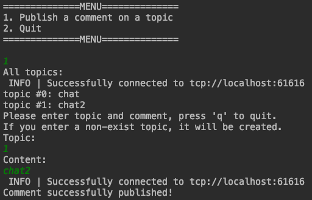

We can see the new topic `1` right away when we try to publish another content.

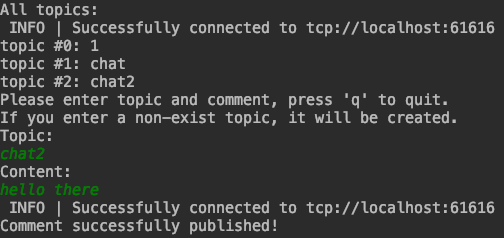

Then we login as `user`. After login successes, we revceive the messages from the subscribed topics including the two comments by `user` himself.

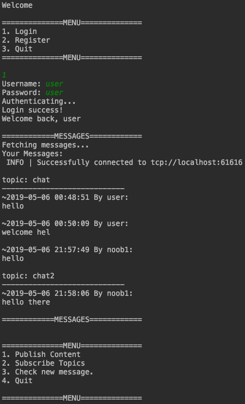

Later we can subscribe to other topics. In this case, topic `1` is chosen.

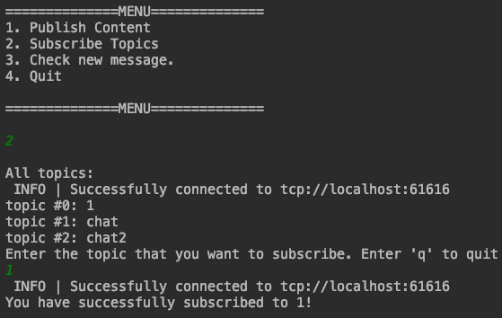

Now let's check if there's any new messages in the subscribed topics. Since no messages is sent to these topics, we should get empty from all three topics.

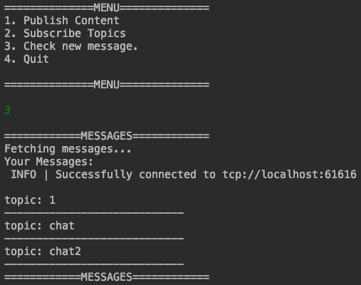
